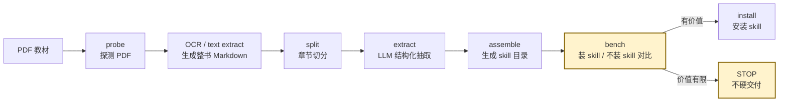

<div align="center">

# textbook2skill

**把一本 PDF 教材变成 Claude Code / Codex 能长期使用的领域知识 skill。**

你给它一本教材，它负责 OCR、切章节、提炼知识、生成 skill 文件，并用测试题验证：装上这个 skill 之后，模型到底有没有比直接回答更好。

[](LICENSE)
[](https://code.claude.com/docs/en/skills)
[](agents/openai.yaml)
[](https://www.python.org/)
[](#实测结论)

[TL;DR](#tldr) · [Quickstart](#quickstart) · [工作原理](#工作原理) · [实测结论](#实测结论) · [边界](#边界) · [路线图](#路线图)

</div>

---

## TL;DR

你手里有一本 PDF 教材，想让 Claude Code / Codex 以后回答相关问题时“记得这本书”。最直接的办法是每次把 PDF 或长文本塞进上下文，但这很慢、很贵，也不好复用。

`textbook2skill` 做的是另一件事：**把这本教材提前整理成一个 skill**。生成后的 skill 可以安装到 `~/.claude/skills/`，以后模型遇到相关问题时，会按 skill 描述加载对应章节里的概念、公式、例题和易混点。

完整流程是：

```text
PDF 教材
  -> 探测文字层和页数
  -> OCR 或提取文本
  -> 按章节切分
  -> 抽取每章的关键知识
  -> 生成 skill 目录
  -> 出题并比较“装 skill”和“不装 skill”
  -> 只在数据说有价值时建议安装
```

最后得到的是一个普通文件夹：

```text
my-textbook-skill/
├── SKILL.md
├── chapters/
└── agents/openai.yaml
```

它不是：

| 不是 | 原因 |
|------|------|
| 不是 RAG 系统 | 它不启动检索服务，也不维护向量库；它只是生成一组可安装的 skill 文件 |
| 不是模型微调 | 它不会训练模型，只是把教材整理成模型容易使用的参考资料 |
| 不是“所有教材都能提分”的承诺 | 很多主流教材模型本来就会，所以必须实测有没有提升 |
| 不是通用 PDF 工具 | 小说、博客、论文合集、会议材料不适合；目标输入是结构清晰的教材或内部手册 |

最适合的场景：

- 公司私有 SOP、内部培训材料、业务规则手册
- 新法规、新标准、小语种或小众领域教材
- 一本书里有独特术语、公式口径、案例方法或判断标准
- 你需要多个领域 skill 同装，并且希望 agent 能正确路由和拒答教材外问题

一句话：**textbook2skill 把“给人读的教材”整理成“给模型用的 skill”，并且会用测试结果拦住那些装了也没帮助的 skill。**

## 输入和输出

### 输入

| 输入 | 说明 |
|------|------|
| PDF 教材 | 扫描版和文字层 PDF 都支持；扫描版默认走 MinerU OCR |
| OCR Markdown | 如果你已经有整书 Markdown，可用 `--ocr-cache` 跳过 OCR |
| 元数据 | skill 名、书名、领域名、安装位置、OCR / LLM 服务选择 |
| API key | 扫描版需要 `MINERU_TOKEN`；LLM 抽取默认需要 `DEEPSEEK_KEY` |

### 输出

生成的 skill 目录大致如下：

```text
<generated-skill>/
├── SKILL.md                 # Claude Code 入口和路由描述
├── chapters/
│   ├── 01-*.md              # 每章的结构化知识
│   ├── 02-*.md
│   └── ...
└── agents/
    └── openai.yaml          # 给 Codex 等工具识别用的元数据
```

同时会在 build 目录生成：

```text
probe.json
ocr-output.md
chapters.json
extracted/
benchmark-questions.json
benchmark.json
state.json
```

## Quickstart

### 1. 安装 textbook2skill

推荐安装到个人 skills 目录，这样所有项目都能用：

```bash
git clone https://github.com/niuniu-869/textbook2skill.git \
  "$HOME/.claude/skills/textbook2skill"
```

然后安装运行依赖：

```bash
python3 -m pip install requests pyyaml

# Ubuntu / Debian
sudo apt-get install -y qpdf poppler-utils

# macOS
brew install qpdf poppler
```

### 2. 准备 API key

```bash
export MINERU_TOKEN="..."     # 扫描版 PDF OCR 需要
export DEEPSEEK_KEY="..."     # 默认 LLM 服务
```

也支持 `OPENAI_API_KEY`、`ANTHROPIC_API_KEY`，通过 `--llm-provider` 选择。

### 3. 让 Claude Code 使用它

```text
/textbook2skill
```

或者直接说：

```text
把 /absolute/path/to/book.pdf 编译成一个 skill，名字叫 financial-engineering
```

Claude 会按 [SKILL.md](SKILL.md) 的流程执行。它不会替你擅自决定这些事：

- PDF 路径
- skill 名
- 安装位置
- OCR 服务
- LLM 服务
- 覆盖已有 skill 时是否备份

### 4. 也可以直接跑脚本

如果你不想通过 Claude Code 交互，可以直接运行骨架脚本：

```bash
cd "$HOME/.claude/skills/textbook2skill"

python3 "skeleton/pipeline.py" \
  --pdf "/absolute/path/to/book.pdf" \
  --skill-name "financial-engineering" \
  --book-title "金融工程 第4版" \
  --domain "金融工程" \
  --output "/tmp/textbook2skill-financial-engineering" \
  --prompts "prompts" \
  --ocr-provider "mineru" \
  --llm-provider "deepseek" \
  --resume
```

生成结果在：

```text
/tmp/textbook2skill-financial-engineering/skill/
```

安装步骤见 [steps/8-install.md](steps/8-install.md)。默认策略是 backup-then-copy，不直接删除旧 skill。

## 工作原理



| 步骤 | 目标 | 关键文件 |
|------|------|----------|
| 1. 准备 | 收集 PDF、skill 名、安装位置 | [steps/1-prerequisites.md](steps/1-prerequisites.md) |
| 2. 探测 | 判断是否需要 OCR，检查页数和语言 | [skeleton/probe.py](skeleton/probe.py) |
| 3. OCR | 把扫描版 PDF 转成 Markdown | [skeleton/ocr_mineru.py](skeleton/ocr_mineru.py) |
| 4. 切章 | 把整书 Markdown 切成章节 | [skeleton/split.py](skeleton/split.py) |
| 5. 抽取 | 每章提取概念、公式、流程、例题、易混点 | [skeleton/extract.py](skeleton/extract.py) |
| 6. 组装 | 写出符合 skill 规范的目录 | [skeleton/assemble.py](skeleton/assemble.py) |
| 7. Benchmark | 比较“装 skill”和“不装 skill”的答题效果 | [skeleton/bench.py](skeleton/bench.py) |
| 8. 安装 | 备份旧版本并复制新 skill | [steps/8-install.md](steps/8-install.md) |

端到端脚本是 [skeleton/pipeline.py](skeleton/pipeline.py)。每个步骤都可以单独重跑，`state.json` 会记录已经完成的阶段。

## 为什么必须测试效果

生成 skill 很容易，生成一个真的有用的 skill 才是问题。这个项目把效果测试放进交付流程，是为了回答一个直接的问题：

> 装上这个 skill 以后，模型是不是比不装更会答这本书相关的问题？

效果测试的基本逻辑：

1. 基于教材内容生成原创题，避免直接复制原题
2. 对同一批题跑两组回答：WITH skill 和 WITHOUT skill
3. 比较正确率、难度分层、章节分层和路由准确率
4. 用 McNemar exact test 和置信区间避免把小样本噪声包装成提升
5. 如果差距太小，或者 skill 反而拖累模型，默认停止，不建议安装

判断口径见 [steps/7-bench.md](steps/7-bench.md)。

## 实测结论

截至 2026-05-06，项目跑过 1 本早期样例和 4 本额外压测。结论很朴素：**它不是万能增强器，但在路由、多 skill 共存、教材独有知识上有实际价值。**

| 观察 | 结论 |
|------|------|
| 主流教材整书准确率 | 多数 case 与模型直接回答的差距落在小样本噪声范围内 |
| 难题 / 多步题 / 教材独有口径题 | 观察到正向收益，但样本量仍小，需要更大评估 |
| 多 skill 同装路由 | 4 skill 同装时 top-1 routing 92.7%，教材外 reject recall 100% |
| 公式密集章节 | V0 有明显收益，但后续 BSM 公式章未复现大幅提升 |
| 真正杀手场景 | 预计在私有、冷门、新发布知识上更强，但仍需要公开 case 验证 |

完整历史数据、坑点和修复记录见：

- [pitfalls.md](pitfalls.md)
- [skeleton/chapter_quality_report.py](skeleton/chapter_quality_report.py)
- [steps/7-bench.md](steps/7-bench.md)

## 什么时候不该用

- 主流基础课教材，尤其是模型直接回答已经接近满分的领域
- 章节结构混乱、目录缺失、标题被 OCR 打碎的 PDF
- 大量内容是习题答案、参考文献、案例堆叠而非教学正文的材料
- 小说、新闻、博客、论文合集、幻灯片合集

更值得尝试的是：

- 内部 SOP、合规手册、专有培训材料
- 领域术语和判断口径与公开语料差异很大的教材
- 新标准、新法规、新产品文档
- 小语种或低资源学科材料

## 与 RAG / 长上下文的区别

| 方案 | 适合什么 | 代价 |
|------|----------|------|
| 长上下文直接塞 PDF | 偶尔问一次、材料不大 | 每次查询都重新消耗上下文 |
| RAG | 文档很多、需要动态检索 | 需要索引、召回、切块、服务和评估链路 |
| textbook2skill | 一本高价值教材要长期复用 | 一次性编译，之后按 skill 自动路由和加载 |

textbook2skill 不替代 RAG。更实际的组合是：把稳定的领域方法论做成 skill，把频繁变化的大规模资料放进 RAG。

## 仓库结构

```text
.
├── SKILL.md                 # textbook2skill 自身的 Claude Code skill 入口
├── README.md                # 面向 GitHub 读者的人类入口
├── steps/                   # 8 个执行步骤的操作手册
├── skeleton/                # 最小可执行 Python 骨架
├── prompts/                 # 抽取、路由、出题、评分 prompt
├── agents/openai.yaml       # Codex / OpenAI 元数据
├── pitfalls.md              # 实跑踩坑和修复记录
└── LICENSE
```

## 配置

### OCR 服务

| 服务 | 状态 | 说明 |
|----------|------|------|
| MinerU | 已实现，默认 | 扫描版 PDF、中文教材、公式较多时优先 |
| Mistral OCR | 路线图 | 适合已有 Mistral quota 的用户 |
| Anthropic Files API | 路线图 | 适合已有 Claude API quota 的用户 |
| 自部署 marker | 路线图 | 适合数据敏感、不能出网的场景 |

### LLM 服务

| 服务 | 状态 | 环境变量 |
|----------|------|----------|
| DeepSeek | 已实现，默认 | `DEEPSEEK_KEY` |
| OpenAI | 已实现 | `OPENAI_API_KEY` |
| Anthropic | 已实现 | `ANTHROPIC_API_KEY` |
| Custom | 预留 | 见 [skeleton/llm.py](skeleton/llm.py) |

注意：不要随意给 reasoning 模型传 `max_tokens` 和 `temperature`。这个坑已经在实跑中触发过，详见 [pitfalls.md](pitfalls.md)。

## 常见问题

### 生成一个 skill 要多久？

300 页左右的教材，LLM 抽取和组装通常是分钟级。扫描版 PDF 的主要耗时在 OCR 上传和排队，可能从几十分钟到数小时不等，取决于文件大小和网络。

### 效果测试分数低是不是失败？

不是。分数低说明这本教材对当前模型帮助不大，或者抽取和路由还需要修。这个结果比盲目安装更有用。

### 已有 OCR Markdown 能不能跳过 OCR？

可以。直接传：

```bash
--ocr-cache "/absolute/path/to/book.md"
```

### 能批量处理很多书吗？

当前设计是一次一本，因为每本书的命名、安装位置、OCR 选择和测试结果都应该单独确认。批量处理可以自己包一层脚本调用 [skeleton/pipeline.py](skeleton/pipeline.py)。

## 路线图

- [ ] 在真正训练稀缺的领域跑出公开、可复现的大收益 case
- [ ] 加固英文教材 TOC 和章节切分策略
- [ ] 增加 Mistral OCR、Anthropic Files API、自部署 OCR 接入
- [ ] 改进测试题型，覆盖论述、推导和多步证明
- [ ] 给生成 skill 增加更完整的安装脚本和冒烟测试
- [ ] 增加 CI，使用小型样例数据跑端到端回归

## 贡献

优先欢迎这几类 PR：

1. 新领域测试 case，尤其是私有、冷门、新发布知识
2. 更稳的章节切分策略和 OCR 清洗逻辑
3. 新 OCR / LLM 服务接入
4. 效果测试、路由和评分的可复现改进
5. 对 [pitfalls.md](pitfalls.md) 的实跑补充

提交改动时请尽量提供：

- 输入材料类型和页数
- 切章质量报告
- WITH/WITHOUT 效果测试
- 路由准确率
- 失败 case 或边界说明

## 参考

本 README 的结构参考了成熟 skill 仓库和官方文档：

- [Anthropic Skills](https://github.com/anthropics/skills)：先解释 skill 是什么，再说明仓库内容、安装和创建方式
- [Trail of Bits Skills Marketplace](https://github.com/trailofbits/skills)：用短介绍、安装方式和清晰目录表快速建立读者心智
- [Claude Code Skills docs](https://code.claude.com/docs/en/skills)：skill 由 `SKILL.md` 加可选脚本、模板、示例和参考资料组成，复杂 skill 应把正文保持聚焦

## License

[MIT](LICENSE) © 2026 textbook2skill contributors
