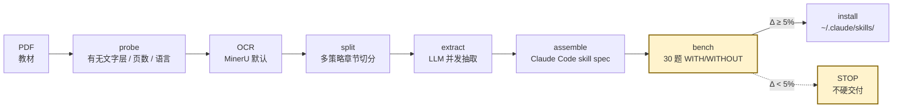

<div align="center">

# textbook2skill

**把任意 PDF 教材编译成可被 Claude Code 调用的领域知识 skill。**

_A meta-skill that compiles any textbook PDF into a benchmark-validated Claude Code skill._

[](LICENSE)
[](https://code.claude.com/docs/en/skills)
[](https://developers.openai.com/codex/skills)
[](https://www.python.org/)
[](#real-world-benchmark)

[Quickstart](#quickstart) · [Why](#why-textbooks) · [How it works](#how-it-works) · [Benchmark](#real-world-benchmark) · [FAQ](#faq) · [Pitfalls](pitfalls.md)

</div>

---

## TL;DR

```
PDF → probe → OCR → 切章 → LLM 抽取 → 组装 → benchmark → 安装到 ~/.claude/skills/
                                                  ▲
                                          没有 benchmark 就没有 skill
```

一条 pipeline 把一本 300 页的专业教材，**10 分钟**变成一个 Claude Code 自动路由、可验证、可复用的领域专家 skill。

- **真正测过**：在 330 页《高级管理会计》上跑通 V0，hard 题 +17%，公式密集章节 +50%（[完整数据](#real-world-benchmark)）
- **不替你做决策**：OCR 厂商 / LLM 厂商 / 安装位置 / 是否覆盖 — 全部在交互式决策点用 `AskUserQuestion` 问你
- **必跑 benchmark**：30 题 WITH/WITHOUT 对比 + McNemar 显著性检验，差距 <5% 时 STOP，不硬交付
- **跨 harness**：Anthropic Claude Code（`SKILL.md`）+ OpenAI Codex（`agents/openai.yaml`）双侧 metadata

---

## Quickstart

> **30 秒**装好，**一句话**触发。

```bash
# 1) 装到个人 skills 目录
git clone https://github.com/niuniu-869/textbook2skill.git \
  ~/.claude/skills/textbook2skill

# 2) 准备依赖
pip install requests
sudo apt-get install -y qpdf poppler-utils      # macOS: brew install qpdf poppler

# 3) 拿到两个 key（运行时按需输入，不硬编码）
export MINERU_TOKEN=...        # 扫描版 PDF OCR
export DEEPSEEK_KEY=...        # LLM 抽取（默认，最便宜）

# 4) 在 Claude Code 里触发
#    /textbook2skill   或者直接说："把 /path/to/book.pdf 做成 skill"
```

Claude 会按 `SKILL.md` 走完 pipeline，在 6 个关键决策点用 `AskUserQuestion` 跟你确认。最后输出：

```
DONE — skill `gao-ji-guan-li-kuai-ji` installed at ~/.claude/skills/gao-ji-guan-li-kuai-ji
Coverage: 11 章 / 87 个核心概念
Benchmark: WITH 90.3% / WITHOUT 83.9% / Δ +6.5% (95% CI: [+1.2%, +11.8%])
路由准确率: 90%
判断: 推荐交付（hard 题 +17%, 公式密集章节 +50%）
```

---

## Why textbooks

> 大学专业课课本是地球上**最适合做 AI skill** 的语料。我们之前还误会过——以为有些课本"不讲人话"。其实人家早就在为 AI 阅读布局了。

| 教材天然结构 | LLM pipeline 对应 |
|--------------|-------------------|
| 章节目录 | 现成的 **chunking**（避免一次性塞全书） |
| 例题 + 解题步骤 | 现成的 **few-shot**（每个概念都配带数字的完整推理） |
| 课后习题 | 现成的 **eval**（验证 AI 是否真懂） |
| 公式 / 术语表 | **100% 精确化**的领域语言（不需要再"提炼"） |
| 学习目标段落 | 章节语义锚点（OCR 丢章节号时的兜底） |

经典教材的作者花几年到几十年把一个学科结构化、压缩、配套例题——`textbook2skill` 只是**搬运工**，把这份成果搬到 LLM 能消费的形式里。

---

## How it works



**8 个步骤，每步独立可重跑**（详见 [`steps/`](steps/)）：

| # | 步骤 | 说明 | 骨架代码 |
|---|------|------|---------|
| 1 | prerequisites | 收集 PDF 路径 / skill 名 / 安装位置 | — |
| 2 | probe | 文字层 / 页数 / 语言探测 | [`skeleton/probe.py`](skeleton/probe.py) |
| 3 | OCR | MinerU 默认（可换 Mistral / Anthropic Files） | [`skeleton/ocr_mineru.py`](skeleton/ocr_mineru.py) |
| 4 | split | TOC-first → H1+size → 语义锚点 → LLM 兜底 | [`skeleton/split.py`](skeleton/split.py) |
| 5 | extract | 默认 DeepSeek-v4-flash（便宜），并发抽取 | [`skeleton/extract.py`](skeleton/extract.py) |
| 6 | assemble | 符合 [Claude Code skill spec](https://code.claude.com/docs/en/skills) | [`skeleton/assemble.py`](skeleton/assemble.py) |
| 7 | **bench** | **必跑** WITH/WITHOUT + McNemar 检验 | [`skeleton/bench.py`](skeleton/bench.py) |
| 8 | install | backup-then-copy（不 `rm -rf` 旧 skill） | — |

端到端编排器：[`skeleton/pipeline.py`](skeleton/pipeline.py)。

---

## Real-world benchmark

完整 V0 实跑数据（2026-05-02，《高级管理会计理论与实务》330 页中文扫描版 PDF / 76 MB / 11 章）。

**处理时长**：~10 分钟（不含 MinerU OCR 网络等待 ~15 分钟）

**Benchmark：30 道原创题，覆盖所有 11 章**

| 维度 | WITH skill | WITHOUT skill | Δ |
|------|------------|---------------|---|
| 总分 | **90.3%** (28/31) | 83.9% (26/31) | +6.5% _(McNemar 不显著)_ |
| Easy 题 | 90% | 90% | +0% |
| Medium 题 | 87% | 87% | +0% |
| **Hard 题** | **83%** | 67% | **+17%** |
| **第 2 章（19 个公式）** | **4/4 (100%)** | 2/4 (50%) | **+50%** |
| 其余 10 章 | 89% | 89% | +0% |

**章节路由准确率**：~90%

### 关键观察

1. **DeepSeek-v4-flash 对管理会计基础题 baseline 已经 84%** — 总差距 +6.5% 落在统计噪声内
2. **真正加分集中在两个场景**：
   - 公式密集章节（标准成本系统：19 个公式 + 完全成本法 vs 变动成本法）→ **+50%**
   - Hard 题（多步推理 / 教材独有口径） → **+17%**
3. **简单概念题 LLM 自带知识就够** → Easy +0%

### 结论

> 主流学科（LLM 训练充分的领域）：skill 在**公式密集章节 + 难题**上有显著价值；主流概念上提升有限。
>
> **真正的杀手场景是 LLM 不熟悉的领域**——特定行业法规、公司内部 SDK、小众专业、医学指南、内部 wiki……欢迎 PR 在这些领域跑出 +30%+ 的 case。

---

## Installation

### 个人 skills（推荐）

```bash
git clone https://github.com/niuniu-869/textbook2skill.git \
  ~/.claude/skills/textbook2skill
```

### 项目内 skills

```bash
mkdir -p .claude/skills
git clone https://github.com/niuniu-869/textbook2skill.git \
  .claude/skills/textbook2skill
```

### OpenAI Codex（实验性）

```bash
mkdir -p ~/.agents/skills
git clone https://github.com/niuniu-869/textbook2skill.git \
  ~/.agents/skills/textbook2skill
```

`agents/openai.yaml` 是与 `SKILL.md` 平行的 Codex metadata，含 `allow_implicit_invocation` 等 policy 字段。

### 系统依赖

| 工具 | 用途 | 安装 |
|------|------|------|
| `python3 >= 3.10` | 运行 skeleton | — |
| `requests` | LLM / OCR HTTP 调用 | `pip install requests` |
| `qpdf` | PDF 切块 | `apt install qpdf` / `brew install qpdf` |
| `pdfinfo` `pdftotext` | PDF 探测 | `apt install poppler-utils` / `brew install poppler` |

### API key（运行时按需）

| 变量 | 用途 | 默认 |
|------|------|------|
| `MINERU_TOKEN` | 扫描版 OCR | ✓ 默认 |
| `DEEPSEEK_KEY` | LLM 抽取 / benchmark | ✓ 默认（最便宜） |
| `OPENAI_API_KEY` | 备选 LLM | 用户选时 |
| `ANTHROPIC_API_KEY` | 备选 LLM | 用户选时 |

---

## Usage

### 1. 在 Claude Code 里触发

```
/textbook2skill
```

或在请求里点名：

```
我有一本 PDF 教材在 /path/to/book.pdf，用 textbook2skill 帮我做成 skill
```

Claude 会按 `SKILL.md` 自动走完整 pipeline，在 6 个决策点用 `AskUserQuestion` 跟你确认。

### 2. 直接跑 skeleton（调试用）

```bash
cd ~/.claude/skills/textbook2skill/skeleton

python3 pipeline.py \
  --pdf /path/to/book.pdf \
  --skill-name my-textbook \
  --book-title "教材名称" \
  --output /tmp/build \
  --prompts ../prompts
```

### 3. 单步重跑

任何一步崩了都能从中间产物续跑，不用从头：

```bash
python3 probe.py /path/to/book.pdf                              # step 2
python3 ocr_mineru.py /path/to/book.pdf /tmp/ocr-out            # step 3
python3 split.py /tmp/book.md /tmp/chapters.json                # step 4
python3 extract.py /tmp/chapters.json /tmp/extracted ../prompts # step 5
python3 assemble.py /tmp/extracted /tmp/skill my-name "教材名"   # step 6
python3 bench.py /tmp/skill /tmp/questions.json ../prompts      # step 7
```

---

## Project structure

```
textbook2skill/
├── SKILL.md                    # ★ Claude Code 入口（frontmatter + 工作流）
├── agents/
│   └── openai.yaml             # OpenAI Codex 平行 metadata
├── steps/                      # 8 个步骤的详细说明（按需 Read）
│   ├── 1-prerequisites.md
│   ├── 2-probe.md
│   ├── 3-ocr.md
│   ├── 4-split.md
│   ├── 5-extract.md
│   ├── 6-assemble.md
│   ├── 7-bench.md              # 必跑 benchmark
│   └── 8-install.md
├── prompts/                    # LLM prompt 模板
│   ├── extraction.md           # 章节抽取
│   ├── routing.md              # 章节路由 (top-k)
│   ├── question-gen.md         # benchmark 出题
│   └── question-grader.md      # benchmark 评分（可选）
├── skeleton/                   # 最小可执行 Python 骨架
│   ├── README.md
│   ├── llm.py                  # LLM 客户端（DeepSeek/OpenAI/Anthropic 兼容）
│   ├── probe.py                # PDF 探测
│   ├── ocr_mineru.py           # MinerU OCR adapter
│   ├── split.py                # 多策略章节切分
│   ├── extract.py              # 并发 LLM 抽取
│   ├── assemble.py             # skill 组装（spec-compliant）
│   ├── bench.py                # benchmark + McNemar test
│   └── pipeline.py             # 端到端编排器
├── examples/                   # （预留）示例 skill 输出
├── pitfalls.md                 # V0 实测 9 大坑（按成本排序）
├── LICENSE                     # MIT
└── README.md                   # 本文件
```

---

## Configuration

### 选 OCR 厂商

`SKILL.md` 在 step 3 用 `AskUserQuestion` 让你选：

| 厂商 | 何时选 | 状态 |
|------|--------|------|
| **MinerU** | 中文扫描版 / 公式多 / 不想自己部署 | ✓ 默认（已实现） |
| Mistral OCR | 英文文档 / 已有 Mistral key | 路线图 |
| Anthropic Files API | 已有 Claude API quota | 路线图 |
| 自部署 marker | 数据敏感 / 不想出网 | 路线图 |

加新 OCR 厂商：复制 `skeleton/ocr_mineru.py` → `skeleton/ocr_<provider>.py`，实现同样的 `(pdf_path, out_dir) → book.md` 接口。

### 选 LLM 厂商

| 厂商 / 模型 | 何时选 | 状态 |
|------------|--------|------|
| **DeepSeek-v4-flash** | 默认（最便宜，reasoning 质量好） | ✓ 已实现 |
| GPT-4o / GPT-5 | 已有 OpenAI quota | ✓ 已实现 |
| Claude Sonnet / Opus | 中文复杂语境 / 已有 Anthropic quota | ✓ 已实现 |

`skeleton/llm.py` 用统一 OpenAI-compatible 接口，加新模型只需在 `configs` 字典加一行。

> ⚠️ **不要传 `max_tokens` 和 `temperature`**——DeepSeek-v4-flash 等 reasoning 模型设了反而 content 为空（[P1 坑](pitfalls.md#p1)）。

---

## FAQ

<details>
<summary><b>这跟把 PDF 喂给 Claude / RAG 有什么区别？</b></summary>

- **RAG / 长上下文**：每次查询动态检索，token 成本随查询数线性增长，召回质量看 chunking 策略
- **textbook2skill**：一次性把教材**结构化压缩**成 skill 文件，写到 `~/.claude/skills/`，未来所有 Claude Code 会话**自动按 description 路由**到这个 skill，不用每次重新喂 PDF

skill = "训练好的领域专家"；RAG = "每次查字典"。两者可叠加。
</details>

<details>
<summary><b>为什么必须跑 benchmark？</b></summary>

主流学科 LLM baseline 已经很强（管理会计 84%）。不跑 benchmark 你**根本不知道 skill 加了多少分**，可能花 10 分钟做出一个 +0% 的 skill 而不自知。

`textbook2skill` 用 30 题 WITH/WITHOUT 对比 + McNemar 显著性检验，差距 <5% 时 STOP 不硬交付。底线，不是判决。
</details>

<details>
<summary><b>支持英文教材吗？</b></summary>

OCR 和 LLM prompt 设计上兼容（MinerU 支持英文，DeepSeek/GPT/Claude 都支持英文），但**没有系统测过**。欢迎 PR 跑通一本英文专业教材，加到 `examples/`。
</details>

<details>
<summary><b>处理一本书要多少钱？</b></summary>

V0 实跑（330 页中文）：
- MinerU OCR：免费 quota 内（注册送）
- DeepSeek 抽取（11 章并发）：< $0.10
- DeepSeek benchmark（30 题 × 2）：< $0.05
- **总成本 < $0.20 / 本**

换 Claude Sonnet 抽取约 10x 成本，质量提升对主流学科**不显著**（参考 benchmark）。
</details>

<details>
<summary><b>能批量处理多本书吗？</b></summary>

V0 设计为"一次一本"——每本都要 6 个交互决策点。批量场景（图书馆、教材出版社）建议自己写 wrapper 调 `skeleton/pipeline.py` + 预先填好 config，绕过 `AskUserQuestion`。

跨教材组合（同时用多个 skill 协同回答）在 [Roadmap](#roadmap)。
</details>

<details>
<summary><b>跟 Anthropic 官方 skill 规范一致吗？</b></summary>

`SKILL.md` 严格按 [Claude Code skills 文档](https://code.claude.com/docs/en/skills) 写：
- frontmatter 含 `name` / `description` / `when_to_use` / `allowed-tools`
- 工作流文档化在 `steps/`
- 关键决策走 `AskUserQuestion`

OpenAI Codex 侧用 `agents/openai.yaml` 平行声明（`allow_implicit_invocation` 等）。
</details>

---

## Pitfalls (must-read)

V0 实测踩过 9 个坑，按成本排序在 [`pitfalls.md`](pitfalls.md)。**top 3**（每个都让我至少多花 30 分钟）：

1. **DeepSeek-v4-flash 设了 `max_tokens` → content 为空**（reasoning 模型陷阱）
2. **章节切分用 `# 第N章` 正则 → TOC 条目被误识别成章节**
3. **OCR 偶尔丢章节号 → 漏章**（要用 strategy chain 兜底）

---

## Roadmap

- [ ] 多 OCR 提供商（Mistral OCR / Anthropic Files / 自部署 marker）
- [ ] LLM-as-judge 评分兜底（`prompts/question-grader.md` 已留模板）
- [ ] 增量更新（新版本教材增量重抽取）
- [ ] 跨教材组合（让 Claude 同时用多个 skill 协同回答）
- [ ] Web UI（单 PDF drag-drop）
- [ ] 英文教材的系统性测试
- [ ] CI 集成（每次 PR 跑 examples/ 里的 mini-benchmark）

---

## Contributing

欢迎 PR。优先级最高的方向：

1. **在 LLM 不熟悉的领域跑出 +30% 的 case**——这是 textbook2skill 的真正杀手场景
2. **新 OCR / LLM 厂商 adapter**（参考 `skeleton/ocr_mineru.py` / `skeleton/llm.py` 的 `configs`）
3. **新切章策略**（在 `skeleton/split.py` 的 `strategies` 列表加 strategy 函数）
4. **pitfalls 补充**（V0 只跑了一本中文教材，肯定还有更多坑）

提交时请：
- 跑通 `skeleton/pipeline.py` 完整 pipeline
- 提供 benchmark 数据（WITH/WITHOUT + 章节路由准确率）
- 关键决策不要绕过 `AskUserQuestion`

---

## Design references

设计经过：

- **V0 实跑**（2026-05-02，330 页中文管理会计教材）
- **Anthropic 官方 skill 规范对齐**（[code.claude.com/docs/en/skills](https://code.claude.com/docs/en/skills)）
- **OpenAI Codex skill 规范对齐**（[developers.openai.com/codex/skills](https://developers.openai.com/codex/skills)）
- **gstack 系列 skill 的交互模式参考**（`AskUserQuestion` 严格 D-编号 / ELI10 / Stakes / Recommendation / Pros-Cons / Net 格式）
- **Codex 独立 review**（指出 V0 的 7 个架构问题，全部修订）

---

## License

[MIT](LICENSE) © 2026 textbook2skill contributors

---

<div align="center">

**没有 benchmark 就没有 skill。**

_Made with educator-grade rigor for LLM-grade consumption._

</div>
